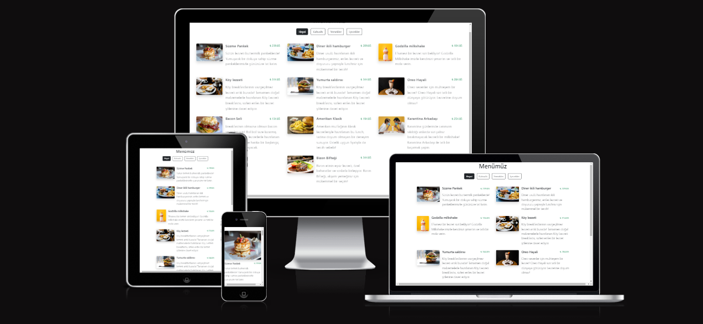

# QRMenu Project

This project includes an interactive web platform where restaurants or cafes can present their menus to customers using QR codes. The project utilizes HTML, CSS, and JavaScript. Users can view the menu, access product details. The project also incorporates responsive design principles and some CSS animations.

---

## Homepage (index.html)

The homepage directs users to the project and provides access to menu categories. The design of the homepage is responsive, ensuring optimal display on various devices.

---

## Product Details Page (product.html)

The product details page contains information about each item in the menu. Users can explore product images, descriptions, and prices on this page. The page is designed following responsive design principles.

---

## Data Management (db.js)

The `db.js` file defines menu items and category-related data, serving as the backbone for data management in the project.

---

## Interface Rendering (details.js and main.js)

The `details.js` and `main.js` files contain JavaScript code responsible for rendering and displaying project interfaces. While the product details page (`details.js`) showcases the details of selected items, the homepage (`main.js`) filters and displays menu items by categories.

---

## Helper Functions (helpers.js)

The `helpers.js` file houses auxiliary functions used in the project. For example, the `calculatePrice` function, used for price calculation, can be found in this file.

---

## Styling (style.css)

The `style.css` file defines the project's overall styling. Notably, adjustments for card designs are made in this stylesheet. Responsive design principles are applied to ensure adaptability across different devices.

To see the project live, you can [click here](https://qrmenujs.netlify.app/).

---

## Responsive Preview

